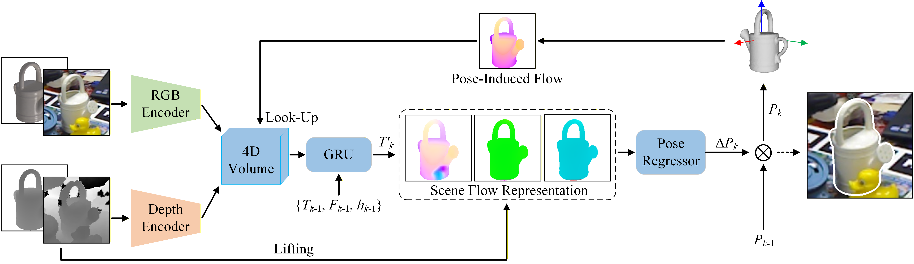

<h1 align="center"> SCFlow2: Plug-and-Play Object Pose Refiner with Shape-Constraint Scene Flow (CVPR 2025) </h1>


<h4 align="center">Qingyuan Wang, Rui Song, Jiaojiao Li, Kerui Cheng, David Ferstl, Yinlin Hu</h5>


<p align="center">
  <a href="https://arxiv.org/abs/2504.09160">
    
  </a>
  <a href="https://scflow2.github.io/">
    
  </a>
  <a href="https://scflow2.github.io/static/images/scflow2_poster.png">
    
  </a>
</p>


## 🔍Introduction

<figure>

<figcaption align = "center"><b>Overview of SCFlow2. </b>Given an RGBD image and an initial pose of the target, we first render the target to obtain a synthetic RGBD image as the reference, and use an RGB encoder and depth encoder to extract features from the image pair, which will be used to create a 4D correlation volume. Based on the correlation volume and GRU, We use an intermediate flow regressor to predict 3D scene flow that is represented as a dense 3D transformation field T<sup>′</sup><sub>k</sub>. We then use a pose regressor to predict a global pose update ∆P<sub>k</sub> based on implicit voting from the pixel-wise 3D transformation field. Finally, the updated pose P<sub>k</sub> is used to compute the pose-induced flow F<sub>k</sub> based on the target mesh to index the correlation volume for the next iteration. Note how the depth and 3D shape of the target are embedded into the framework to guide the optimization iteratively.
 </figcaption>
</figure>


## 📝 Checklist

- ✅ Upload inference code  
- ✅ Upload data processing code  
- ✅ Upload Upload pre-trained weights  
- ⬛ Upload training code  

## 🛠️ Installation
### Basic Dependencies:
- CUDA Version >= 11.8
- Python >= 3.8
- Pytorch >= 2.0.0

### Create a new environment:

```bash
conda create -n scflow2 python==3.10.18
conda activate scflow2
```

### Install necessary packages:
```bash
# Configure basic environment
git clone https://github.com/W-QY/SCFlow2
cd SCFlow2
pip install -r requirements.txt

# Install mmcv
python -m pip install openmim
mim install mmcv_full==1.7.2

# Install pointnet2_ops
git clone https://github.com/erikwijmans/Pointnet2_PyTorch
cd Pointnet2_PyTorch/pointnet2_ops_lib
python setup.py install

# Install bop_toolkit
git clone https://github.com/thodan/bop_toolkit
cd bop_toolkit
python setup.py develop
```

## 📁 Dataset Preparation
### Data Structure：
We follow the data construction methods of [SCFlow](https://github.com/YangHai-1218/SCFlow) and [SAM6D](https://github.com/JiehongLin/SAM-6D) :
```
data
├── Training-Data
    ├── MegaPose-GSO
        ├──google_scanned_objects
        ├──templates
        └──train_pbr_web
    ├── MegaPose-ShapeNetCore
        ├──shapenetcorev2
        ├──templates
        └──train_pbr_web
    ├── FoundataionPose-Objaverse
        ├──shapenetcorev2
        ├──templates
        └──train_pbr_web
└── Testing-BOP   # https://bop.felk.cvut.cz/datasets/
    ├──tudl
    ├──lmo
    ├──ycbv
    ├──icbin
    ├──hb
    ├──itodd
    └──tless
```
### Data Processing:
For ```MegaPose-GSO``` and ```MegaPose-ShapeNetCore```, you can refer to this [link](https://github.com/JiehongLin/SAM-6D/blob/main/SAM-6D/Data/README.md) to download.

For ```FoundataionPose-Objaverse```, you can download the raw data from this [link](https://drive.google.com/drive/folders/1QkdZO_I_l4VvcZq3pQ8VFuWZVq3Jq6px), and then use the ```tools/objaverse_process.py``` script to process the data into BOP format.

For ```Testing-BOP``` datasets, you need to use the ```tools/collect_imagelist.py``` script to get the paths to all images in each ```test_bop19``` folder and add it to ```image_lists```. You can download [ycbv image_lists](https://drive.google.com/drive/folders/1VD8QmXS38hrAUfp2MSnxXuEJLdzPtZvV) and place them under the ```data/Testing-BOP/ycbv/image_lists``` directory.
## 📦 Pretrained weights:

We provide weights pre-trained using the ```MegaPose-GSO```, ```MegaPose-ShapeNetCore``` and ```FoundataionPose-Objaverse``` datasets at [here](https://drive.google.com/drive/folders/1tUBKuc1TOam8lPJBxlvVf5AHf4-IByqZ?usp=drive_link).

## 🤖 Testing

### Prepare initial pose:
You can use the ```tools/bop19_to_refannots.py``` script to process any BOP format ```.csv``` file results and use it as the initial pose, or download [PoseCNN initial](https://drive.google.com/drive/folders/1VD8QmXS38hrAUfp2MSnxXuEJLdzPtZvV) pose and place it under ```data/initial_poses/ycbv_posecnn directory```.

### Evaluate the performance and save the results:
```shell
python test.py --config configs/refine_models/scflow2.py  --checkpoint *** --format-only --save-dir ***
```


## 📑 Citation
If you find this project is helpful, please cite:
 ```
 @inproceedings{wang2025scflow2,
   title={SCFlow2: Plug-and-Play Object Pose Refiner with Shape-Constraint Scene Flow},
   author={Qingyuan Wang and Rui Song and Jiaojiao Li and Kerui Cheng and David Ferstl and Yinlin Hu},
   booktitle={CVPR},
   year={2025}
 }

 @inproceedings{yang2023scflow,
   title={Shape-Constraint Recurrent Flow for 6D Object Pose Estimation},
   author={Yang Hai and Rui Song and Jiaojiao Li and Yinlin Hu},
   booktitle={CVPR},
   year={2023}
 }
 ```

 ## 👍Acknowledgement
We build this project based on [SCFlow](https://github.com/YangHai-1218/SCFlow), [RAFT-3D](https://github.com/princeton-vl/RAFT-3D), [SAM6D](https://github.com/JiehongLin/SAM-6D) and [MMFlow](https://github.com/open-mmlab/mmflow), We thank the authors for their great code repositories.